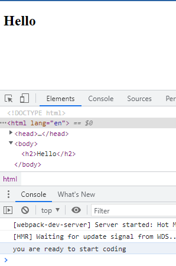
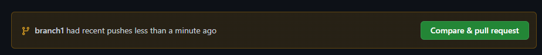
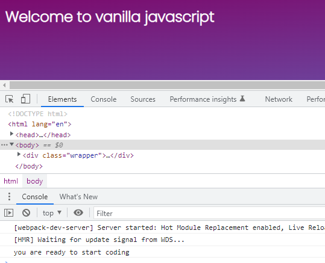
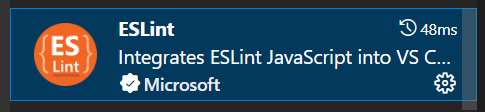
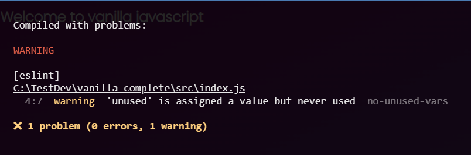
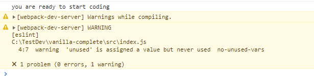
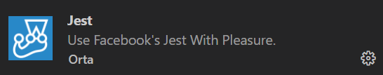
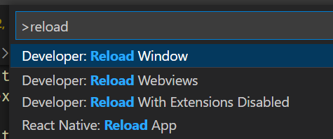

# vanilla complete

This is an introductory course on vanilly javascript from scratch. We are going to build everything for a single page application from scratch. We are going to create an empty folder in our dev folder where we store our javascript projects and we are going to name i vanilla-complet. We are starting with our README.md file. Next we are going to generate our project using this line:

```js
npm init -y
```

Now we have our starting point. Before we link up to github, let's create out .gitignore file and we can do so by typing this code:

```js
npx gitignore node
```

Now let's create a repo on github and link everything up.

```js
git init
git add .
git commit -m "Initial commit"
```

Then just copy the git remote line that github provides you. It will look something like this:

```js
git remote add origin https://github.com/C5m7b4/vanilla-complete.git
```

And then finally we need to run this line in our bash:

```js
git push -u origin master
```

## branch 1

On a side note, if you don't already have node installed and you are on windows, visit [this link](https://github.com/coreybutler/nvm-windows#installation--upgrades) to install it. To use it in each project, simply type:

```js
nvm install lts
```

Optionally, to see a list of all versions available you can type

```js
nvm list available
```

[Here is a link to information about nvm](https://www.freecodecamp.org/news/nvm-for-windows-how-to-download-and-install-node-version-manager-in-windows-10/)

Now let's setup webpack which is what we will use to bundle our javascript.

```js
npm install --save-dev webpack webpack-cli
```

Now let's install prettier, which is our best friend.

```js
npm install prettier --save-dev
```

Then create our .prettierrc file. We'll use the defaults

```js
{}
```

Now we are going to install the webpack dev server

```js
npm install --save-dev webpack-dev-server
```

Now let's create a public folder and stub out an index.html file in it. Don't forget to add an h2 element and put something in it.

Now let's install the html-webpack-plugin

```js
npm install --save-dev html-webpack-plugin
```

Now let's build our webpack config file and it should look like this:

```js
const path = require('path');
const HtmlWebpackPlugin = require('html-webpack-plugin');

module.exports = {
  mode: 'development',
  entry: './src/index.js',
  output: {
    filename: 'bundle.js',
    path: path.resolve(__dirname, 'dist'),
    clean: true,
  },
  devtool: 'inline-source-map',
  devServer: {
    static: './dist',
    port: 3007,
  },
  plugins: [
    new HtmlWebpackPlugin({
      title: 'Vanilla JS',
      template: 'public/index.html',
    }),
  ],
  resolve: {
    extensions: ['.js'],
  },
};
```

Now let's create our src folder and add an index.js file with nothing but a console log statement so we can make sure that things are working. Then we need to add a script to the package.json so we can test out our work.

run this command

```js
npm start
```

And you should have something like this:



Now let's commit what we have created

```js
git add .
git commit -m "add webpack basic setup"
git push -u origin branch1
```

Now you should have your first real branch and you should see this on github:



After you merge in the pull request you want to check back out the master, do a pull to get the latest version of master and then create your next branch.

```js
git checkout master
git pull
git checkout -b branch2
```

## branch 2

Now we need to tell webpack how to handle files:

```js
npm install --save-dev mini-css-extract-plugin
npm install --save-dev babel-loader @babel/preset-env
npm install --save-dev css-loader
npm install @babel/core
```

Now let's update our webpack.config.js to look like this:

```js
const path = require('path');
const HtmlWebpackPlugin = require('html-webpack-plugin');
const MiniCssExtractPlugin = require('mini-css-extract-plugin');

module.exports = {
  mode: 'development',
  entry: './src/index.js',
  output: {
    filename: 'bundle.js',
    path: path.resolve(__dirname, 'dist'),
    clean: true,
  },
  devtool: 'inline-source-map',
  devServer: {
    static: './dist',
    port: 3007,
  },
  plugins: [
    new HtmlWebpackPlugin({
      title: 'Vanilla JS',
      template: 'public/index.html',
    }),
    new MiniCssExtractPlugin(),
  ],
  resolve: {
    extensions: ['.js'],
  },
  module: {
    rules: [
      {
        test: /\.js?$/,
        exclude: /node_modules/,
        use: {
          loader: 'babel-loader',
          options: {
            presets: ['@babel/preset-env'],
          },
        },
      },
      {
        test: /\.css$/i,
        use: [MiniCssExtractPlugin.loader, 'css-loader'],
      },
    ],
  },
};
```

Now we need to kill webpack by doing ctrl-c. Once it's stopped, we now need to setup an initial css file for our styling, but first we need to create the styles.css in our src folder and then get our google font information. You can pick whatever fonts you like. 

```css
@import url('https://fonts.googleapis.com/css2?family=Dongle&family=Mulish:wght@200;500&family=Nunito:wght@200;300;400;500;600;700;800;900&family=Poppins:wght@200&family=Roboto:wght@300;400;700&family=Rubik&display=swap');

* {
  margin: 0;
  padding: 0;
}

body {
  height: 100vh;
  width: 100vw;
  font-family: 'Poppins', sans-serif;
}

.wrapper {
  height: 100%;
  width: 100%;
  margin: 0 auto;
  padding: 10px;
  background: #7b0c6e;
  background: -webkit-linear-gradient(top left, #7b0c6e, #626cbe);
  background: -moz-linear-gradient(top left, #7b0c6e, #626cbe);
  background: linear-gradient(to bottom right, #7b0c6e, #626cbe);
  color: #fff;
}
```

Lastly we need to update our index.html to look like this:

```html
<!DOCTYPE html>
<html lang="en">
<head>
  <meta charset="UTF-8">
  <meta http-equiv="X-UA-Compatible" content="IE=edge">
  <meta name="viewport" content="width=device-width, initial-scale=1.0">
  <title>Vanilla Javascript</title>
</head>
<body>
  <div class="wrapper">
    <h2>Welcome to vanilla javascript</h2>
  </div>
</body>
</html>
```

Whalla, now if you start the project

```js
npm start
```

You should see this:



Alright, let's commit what we have

```js
git add .
git commit -m "add loaders to webpack"
git push -u origin branch2
```

You will see your pull request, so follow through with that and then checkout the master and create your new branch

```js
git checkout master
git pull
git checkout -b branch3
```

## branch 3

It's time to setup eslint, which is also our buddy.

```js
npm install --save-dev eslint eslint-config-prettier eslint-plugin-import
```

We are also going to need one more package so that webpack knows about eslint

```js
npm install eslint-webpack-plugin --save-dev
```

Now we are going to update our webpack.config.js to look like this:

```js
const path = require('path');
const HtmlWebpackPlugin = require('html-webpack-plugin');
const MiniCssExtractPlugin = require('mini-css-extract-plugin');
const EsLintPlugin = require('eslint-webpack-plugin');

module.exports = {
  mode: 'development',
  entry: './src/index.js',
  output: {
    filename: 'bundle.js',
    path: path.resolve(__dirname, 'dist'),
    clean: true,
  },
  devtool: 'inline-source-map',
  devServer: {
    static: './dist',
    port: 3007,
  },
  plugins: [
    new HtmlWebpackPlugin({
      title: 'Vanilla JS',
      template: 'public/index.html',
    }),
    new MiniCssExtractPlugin(),
    new EsLintPlugin(),
  ],
  resolve: {
    extensions: ['.js'],
  },
  module: {
    rules: [
      {
        test: /\.js?$/,
        exclude: /node_modules/,
        use: {
          loader: 'babel-loader',
          options: {
            presets: ['@babel/preset-env'],
          },
        },
      },
      {
        test: /\.css$/i,
        use: [MiniCssExtractPlugin.loader, 'css-loader'],
      },
    ],
  },
};
```

Ok, making progress. Now let's create a file in the root of our project called .eslintrc.json and it should look something like this:

```json
{
  "extends":[
    "eslint:recommended",
    "plugin:import/errors",
    "prettier"
  ],
  "rules":{
    "no-console": 0,
    "no-debugger": 1,
    "no-unused-vars": 1
  },
  "parserOptions": {
    "ecmaVersion": 2021,
    "sourceType": "module"
  },
  "env":{
    "es6":true,
    "browser": true,
    "node": true,
    "jest":true
  }
}
```

To break this down, and it's very simple setup, but we can expand on it over time. The exends does matter which order that you put them in. We can have lots of rules or just some simple ones. Our code usage might dictage which rules we would like to have and now let's see how this looks in reality.

Go to your index.js and let's just add an unsed variable:

```js
const unused = '';
```

And it should look like this:


If this isn't working, then you probably need to install the eslint plugin:



Now we need to take webpack for a test drive to see how it behaves with eslint. Kill you webpack instance and fire it back up to see how this behaves. What you should expect to see is something like this:



So, let's fix this and then we can commit this branch. Modify your webpack.config.js to look like this:

```js
const path = require("path");
const HtmlWebpackPlugin = require("html-webpack-plugin");
const MiniCssExtractPlugin = require("mini-css-extract-plugin");
const EsLintPlugin = require("eslint-webpack-plugin");

module.exports = {
  mode: "development",
  entry: "./src/index.js",
  output: {
    filename: "bundle.js",
    path: path.resolve(__dirname, "dist"),
    clean: true,
  },
  devtool: "inline-source-map",
  devServer: {
    static: "./dist",
    port: 3007,
    compress: true,
    client: {
      overlay: false,
    },
  },
  plugins: [
    new HtmlWebpackPlugin({
      title: "Vanilla js",
      template: "public/index.html",
    }),
    new MiniCssExtractPlugin(),
    new EsLintPlugin(),
  ],
  resolve: {
    extensions: [".js"],
  },
  module: {
    rules: [
      {
        test: /\.js?$/,
        exclude: /node_modules/,
        use: {
          loader: "babel-loader",
          options: {
            presets: ["@babel/preset-env"],
          },
        },
      },
      {
        test: /\.css$/i,
        use: [MiniCssExtractPlugin.loader, "css-loader"],
      },
    ],
  },
};

```

Now you should only see eslint errors in your console:

;

Now we just need to add a linting script to our package.json

```js
"lint": "eslint src/*.js"
```

Now let's commit what we have and create a new branch:

```js
git add .
git commit -m "add eslint"
git push -u origin branch3
```

Merge in your pull request and create a new branch

```js
git checkout master
git pull git checkout -b branch4
```

## branch 4

Now let's stub out a little html that we can interact with with javascript:

```html
<!DOCTYPE html>
<html lang="en">
<head>
  <meta charset="UTF-8">
  <meta http-equiv="X-UA-Compatible" content="IE=edge">
  <meta name="viewport" content="width=device-width, initial-scale=1.0">
  <title>Vanilla JS</title>
</head>
<body>
  <div class="wrapper">
    <h2>Welcome to Vanilla Javascript</h2>
    <div class="new-item">
      <div class="row">
        <div class="col-2">
          <label>Name:</label>
          <input id="name" type="text" />
        </div>
        <div class="col-2">
          <label>Size:</label>
          <input type="text" id="size" />
        </div>
      </div>
      <div class="row">
        <div class="col-2">
          <label>Price:</label>
          <input type="number" id="price" />
        </div>
        <div class="col-2">
          <label>Category</label>
          <div id="item-category"></div>
        </div>
      </div>
      <div class="col-2">
        <button class="btn" id="save-item">Save Item</button>
      </div>
    
      <div id="filter" class="filter-div"></div>
      <div id="items"></div>
      <div id="stats"></div>
    
    </div>
  </div>
</body>
<script type="text/javascript" src="../src/index.js"></script>
</html>
```

That should be good enough for this branch. Let's save our work and commit it to the repo.

```js
git add .
git commit -m "Add html body"
git push -u origin branch4
```

Merge in your pull request and update the project to get ready for the next branch

```js
git checkout master
git pull
git checkout -b branch5
```

## branch 5

Now we are going to add some data to our project just to get started.

```js
export const data = [
  { id: 1, name: 'apple', price: 0.99, size: 'each', category: 'fruit' },
  { id: 2, name: 'bananna', price: 1.1, size: 'each', category: 'fruit' },
  { id: 3, name: 'grapes', price: 1.99, size: 'bundle', category: 'fruit' },
  { id: 4, name: 'apple', price: 0.89, size: 'each', category: 'fruit' },
  {
    id: 5,
    name: 'Dr. Pepper',
    price: 1.09,
    size: '12 oz',
    category: 'beverages',
  },
  { id: 6, name: 'Mt. Dew', price: 4.99, size: '12 pk', category: 'beverages' },
  { id: 7, name: 'Coke', price: 1.79, size: '2 Liter', category: 'beverages' },
  { id: 8, name: 'Pepsi', price: 1.79, size: '2 Liter', category: 'beverages' },
  { id: 9, name: 'Tic Tacs', price: 2.99, size: '12 oz', category: 'candy' },
  { id: 10, name: 'Snickers', price: 1.59, size: 'bar', category: 'candy' },
  { id: 11, name: 'Almond Joy', price: 1.69, size: 'bar', category: 'candy' },
];
```

Now we are going to create a utils.js file in the src folder and we are going to create a helper function called isValid:

```js
export const isValid = (v) => {
  if (typeof v !== 'undefined' && v !== null) return true;
  return false;
};
```

Then let's import that function into our index.js and create some initial state.

```js
console.log('coding is ready');
import { data } from './data';
import { isValid } from './utils';
import './styles.css';

let filteredData = data;

const state = {
  items: data,
  currentItem: {
    name: '',
    size: '',
    price: 0,
    category: '',
  },
};
```

Now let's write some tests for our function. In order for us to do this, we are going to need to install Jest and Babel and then set them up.

```js
npm install jest --save-dev
```

Now let's create a file in the root of our project called .babelrc and it's contents will look like this:

```js
{
  "presets": ["@babel/preset-env"]
}
```

Now create a folder in the root of our project called tests and create a file with the name of utils.test.js

These are going to be our initial tests:

```js
import { isValid } from "../src/utils";

describe("isValid", () => {
  test("should return false for undefined", () => {
    expect(isValid(undefined)).toEqual(false);
  });
  test("shoudl return false for null values", () => {
    expect(isValid(null)).toEqual(false);
  });
  test("should return true for an int", () => {
    expect(isValid(1)).toEqual(true);
  });
  test("should return true for a string", () => {
    expect(isValid("hello")).toEqual(true);
  });
  test("should return true for an array", () => {
    expect(isValid([1, 2, 3])).toEqual(true);
  });
  test("should return true for an object", () => {
    expect(isValid({ name: "mike" })).toEqual(true);
  });
});
```

We also need to make sure that we have the Jest plugin installed:



Since we just added jest, we are probably going to need to refresh vsCode:
Press Ctrl-Shift-P and select reload



Now you should have green ticks next to each of your tests.

Let's save our work and make a commit

```js
git add .
git commit -m "add jest and babel"
git push -u origin branch5
```

Merge you pull request and update the local project

```js
git checkout master
git pull
git checkout -b branch6
```