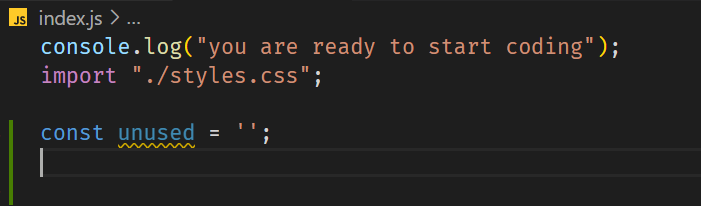

# vanilla complete

[](https://dl.circleci.com/status-badge/redirect/gh/C5m7b4/vanilla-complete/tree/master)


This is an introductory course on vanilly javascript from scratch. We are going to build everything for a single page application from scratch. We are going to create an empty folder in our dev folder where we store our javascript projects and we are going to name i vanilla-complet. We are starting with our README.md file. Next we are going to generate our project using this line:

```js
npm init -y
```

Now we have our starting point. Before we link up to github, let's create out .gitignore file and we can do so by typing this code:

```js
npx gitignore node
```

Now let's create a repo on github and link everything up.

```js
git init
git add .
git commit -m "Initial commit"
```

Then just copy the git remote line that github provides you. It will look something like this:

```js
git remote add origin https://github.com/C5m7b4/vanilla-complete.git
```

And then finally we need to run this line in our bash:

```js
git push -u origin master
```

## branch 1

On a side note, if you don't already have node installed and you are on windows, visit [this link](https://github.com/coreybutler/nvm-windows#installation--upgrades) to install it. To use it in each project, simply type:

```js
nvm install lts
```

Optionally, to see a list of all versions available you can type

```js
nvm list available
```

[Here is a link to information about nvm](https://www.freecodecamp.org/news/nvm-for-windows-how-to-download-and-install-node-version-manager-in-windows-10/)

Now let's setup webpack which is what we will use to bundle our javascript.

```js
npm install --save-dev webpack webpack-cli
```

Now let's install prettier, which is our best friend.

```js
npm install prettier --save-dev
```

Then create our .prettierrc file. We'll use the defaults

```js
{}
```

Now we are going to install the webpack dev server

```js
npm install --save-dev webpack-dev-server
```

Now let's create a public folder and stub out an index.html file in it. Don't forget to add an h2 element and put something in it.

Now let's install the html-webpack-plugin

```js
npm install --save-dev html-webpack-plugin
```

Now let's build our webpack config file and it should look like this:

```js
const path = require('path');
const HtmlWebpackPlugin = require('html-webpack-plugin');

module.exports = {
  mode: 'development',
  entry: './src/index.js',
  output: {
    filename: 'bundle.js',
    path: path.resolve(__dirname, 'dist'),
    clean: true,
  },
  devtool: 'inline-source-map',
  devServer: {
    static: './dist',
    port: 3007,
  },
  plugins: [
    new HtmlWebpackPlugin({
      title: 'Vanilla JS',
      template: 'public/index.html',
    }),
  ],
  resolve: {
    extensions: ['.js'],
  },
};
```

Now let's create our src folder and add an index.js file with nothing but a console log statement so we can make sure that things are working. Then we need to add a script to the package.json so we can test out our work.

run this command

```js
npm start
```

And you should have something like this:


Now let's commit what we have created

```js
git add .
git commit -m "add webpack basic setup"
git push -u origin branch1
```

Now you should have your first real branch and you should see this on github:


After you merge in the pull request you want to check back out the master, do a pull to get the latest version of master and then create your next branch.

```js
git checkout master
git pull
git checkout -b branch2
```

## branch 2

Now we need to tell webpack how to handle files:

```js
npm install --save-dev mini-css-extract-plugin
npm install --save-dev babel-loader @babel/preset-env
npm install --save-dev css-loader
npm install @babel/core
```

Now let's update our webpack.config.js to look like this:

```js
const path = require('path');
const HtmlWebpackPlugin = require('html-webpack-plugin');
const MiniCssExtractPlugin = require('mini-css-extract-plugin');

module.exports = {
  mode: 'development',
  entry: './src/index.js',
  output: {
    filename: 'bundle.js',
    path: path.resolve(__dirname, 'dist'),
    clean: true,
  },
  devtool: 'inline-source-map',
  devServer: {
    static: './dist',
    port: 3007,
  },
  plugins: [
    new HtmlWebpackPlugin({
      title: 'Vanilla JS',
      template: 'public/index.html',
    }),
    new MiniCssExtractPlugin(),
  ],
  resolve: {
    extensions: ['.js'],
  },
  module: {
    rules: [
      {
        test: /\.js?$/,
        exclude: /node_modules/,
        use: {
          loader: 'babel-loader',
          options: {
            presets: ['@babel/preset-env'],
          },
        },
      },
      {
        test: /\.css$/i,
        use: [MiniCssExtractPlugin.loader, 'css-loader'],
      },
    ],
  },
};
```

Now we need to kill webpack by doing ctrl-c. Once it's stopped, we now need to setup an initial css file for our styling, but first we need to create the styles.css in our src folder and then get our google font information. You can pick whatever fonts you like. 

```css
@import url('https://fonts.googleapis.com/css2?family=Dongle&family=Mulish:wght@200;500&family=Nunito:wght@200;300;400;500;600;700;800;900&family=Poppins:wght@200&family=Roboto:wght@300;400;700&family=Rubik&display=swap');

* {
  margin: 0;
  padding: 0;
}

body {
  height: 100vh;
  width: 100vw;
  font-family: 'Poppins', sans-serif;
}

.wrapper {
  height: 100%;
  width: 100%;
  margin: 0 auto;
  padding: 10px;
  background: #7b0c6e;
  background: -webkit-linear-gradient(top left, #7b0c6e, #626cbe);
  background: -moz-linear-gradient(top left, #7b0c6e, #626cbe);
  background: linear-gradient(to bottom right, #7b0c6e, #626cbe);
  color: #fff;
}
```

Lastly we need to update our index.html to look like this:

```html
<!DOCTYPE html>
<html lang="en">
<head>
  <meta charset="UTF-8">
  <meta http-equiv="X-UA-Compatible" content="IE=edge">
  <meta name="viewport" content="width=device-width, initial-scale=1.0">
  <title>Vanilla Javascript</title>
</head>
<body>
  <div class="wrapper">
    <h2>Welcome to vanilla javascript</h2>
  </div>
</body>
</html>
```

Whalla, now if you start the project

```js
npm start
```

You should see this:


Alright, let's commit what we have

```js
git add .
git commit -m "add loaders to webpack"
git push -u origin branch2
```

You will see your pull request, so follow through with that and then checkout the master and create your new branch

```js
git checkout master
git pull
git checkout -b branch3
```

## branch 3

It's time to setup eslint, which is also our buddy.

```js
npm install --save-dev eslint eslint-config-prettier eslint-plugin-import
```

We are also going to need one more package so that webpack knows about eslint

```js
npm install eslint-webpack-plugin --save-dev
```

Now we are going to update our webpack.config.js to look like this:

```js
const path = require('path');
const HtmlWebpackPlugin = require('html-webpack-plugin');
const MiniCssExtractPlugin = require('mini-css-extract-plugin');
const EsLintPlugin = require('eslint-webpack-plugin');

module.exports = {
  mode: 'development',
  entry: './src/index.js',
  output: {
    filename: 'bundle.js',
    path: path.resolve(__dirname, 'dist'),
    clean: true,
  },
  devtool: 'inline-source-map',
  devServer: {
    static: './dist',
    port: 3007,
  },
  plugins: [
    new HtmlWebpackPlugin({
      title: 'Vanilla JS',
      template: 'public/index.html',
    }),
    new MiniCssExtractPlugin(),
    new EsLintPlugin(),
  ],
  resolve: {
    extensions: ['.js'],
  },
  module: {
    rules: [
      {
        test: /\.js?$/,
        exclude: /node_modules/,
        use: {
          loader: 'babel-loader',
          options: {
            presets: ['@babel/preset-env'],
          },
        },
      },
      {
        test: /\.css$/i,
        use: [MiniCssExtractPlugin.loader, 'css-loader'],
      },
    ],
  },
};
```

Ok, making progress. Now let's create a file in the root of our project called .eslintrc.json and it should look something like this:

```json
{
  "extends":[
    "eslint:recommended",
    "plugin:import/errors",
    "prettier"
  ],
  "rules":{
    "no-console": 0,
    "no-debugger": 1,
    "no-unused-vars": 1
  },
  "parserOptions": {
    "ecmaVersion": 2021,
    "sourceType": "module"
  },
  "env":{
    "es6":true,
    "browser": true,
    "node": true,
    "jest":true
  }
}
```

To break this down, and it's very simple setup, but we can expand on it over time. The exends does matter which order that you put them in. We can have lots of rules or just some simple ones. Our code usage might dictage which rules we would like to have and now let's see how this looks in reality.

Go to your index.js and let's just add an unsed variable:

```js
const unused = '';
```

And it should look like this:



If this isn't working, then you probably need to install the eslint plugin:


Now we need to take webpack for a test drive to see how it behaves with eslint. Kill you webpack instance and fire it back up to see how this behaves. What you should expect to see is something like this:


So, let's fix this and then we can commit this branch. Modify your webpack.config.js to look like this:

```js
const path = require("path");
const HtmlWebpackPlugin = require("html-webpack-plugin");
const MiniCssExtractPlugin = require("mini-css-extract-plugin");
const EsLintPlugin = require("eslint-webpack-plugin");

module.exports = {
  mode: "development",
  entry: "./src/index.js",
  output: {
    filename: "bundle.js",
    path: path.resolve(__dirname, "dist"),
    clean: true,
  },
  devtool: "inline-source-map",
  devServer: {
    static: "./dist",
    port: 3007,
    compress: true,
    client: {
      overlay: false,
    },
  },
  plugins: [
    new HtmlWebpackPlugin({
      title: "Vanilla js",
      template: "public/index.html",
    }),
    new MiniCssExtractPlugin(),
    new EsLintPlugin(),
  ],
  resolve: {
    extensions: [".js"],
  },
  module: {
    rules: [
      {
        test: /\.js?$/,
        exclude: /node_modules/,
        use: {
          loader: "babel-loader",
          options: {
            presets: ["@babel/preset-env"],
          },
        },
      },
      {
        test: /\.css$/i,
        use: [MiniCssExtractPlugin.loader, "css-loader"],
      },
    ],
  },
};

```

Now you should only see eslint errors in your console:

;

Now we just need to add a linting script to our package.json

```js
"lint": "eslint src/*.js"
```

Now let's commit what we have and create a new branch:

```js
git add .
git commit -m "add eslint"
git push -u origin branch3
```

Merge in your pull request and create a new branch

```js
git checkout master
git pull git checkout -b branch4
```

## branch 4

Now let's stub out a little html that we can interact with with javascript:

```html
<!DOCTYPE html>
<html lang="en">
<head>
  <meta charset="UTF-8">
  <meta http-equiv="X-UA-Compatible" content="IE=edge">
  <meta name="viewport" content="width=device-width, initial-scale=1.0">
  <title>Vanilla JS</title>
</head>
<body>
  <div class="wrapper">
    <h2>Welcome to Vanilla Javascript</h2>
    <div class="new-item">
      <div class="row">
        <div class="col-2">
          <label>Name:</label>
          <input id="name" type="text" />
        </div>
        <div class="col-2">
          <label>Size:</label>
          <input type="text" id="size" />
        </div>
      </div>
      <div class="row">
        <div class="col-2">
          <label>Price:</label>
          <input type="number" id="price" />
        </div>
        <div class="col-2">
          <label>Category</label>
          <div id="item-category"></div>
        </div>
      </div>
      <div class="col-2">
        <button class="btn" id="save-item">Save Item</button>
      </div>
    
      <div id="filter" class="filter-div"></div>
      <div id="items"></div>
      <div id="stats"></div>
    
    </div>
  </div>
</body>
<script type="text/javascript" src="../src/index.js"></script>
</html>
```

That should be good enough for this branch. Let's save our work and commit it to the repo.

```js
git add .
git commit -m "Add html body"
git push -u origin branch4
```

Merge in your pull request and update the project to get ready for the next branch

```js
git checkout master
git pull
git checkout -b branch5
```

## branch 5

Now we are going to add some data to our project just to get started.

```js
export const data = [
  { id: 1, name: 'apple', price: 0.99, size: 'each', category: 'fruit' },
  { id: 2, name: 'bananna', price: 1.1, size: 'each', category: 'fruit' },
  { id: 3, name: 'grapes', price: 1.99, size: 'bundle', category: 'fruit' },
  { id: 4, name: 'apple', price: 0.89, size: 'each', category: 'fruit' },
  {
    id: 5,
    name: 'Dr. Pepper',
    price: 1.09,
    size: '12 oz',
    category: 'beverages',
  },
  { id: 6, name: 'Mt. Dew', price: 4.99, size: '12 pk', category: 'beverages' },
  { id: 7, name: 'Coke', price: 1.79, size: '2 Liter', category: 'beverages' },
  { id: 8, name: 'Pepsi', price: 1.79, size: '2 Liter', category: 'beverages' },
  { id: 9, name: 'Tic Tacs', price: 2.99, size: '12 oz', category: 'candy' },
  { id: 10, name: 'Snickers', price: 1.59, size: 'bar', category: 'candy' },
  { id: 11, name: 'Almond Joy', price: 1.69, size: 'bar', category: 'candy' },
];
```

Now we are going to create a utils.js file in the src folder and we are going to create a helper function called isValid:

```js
export const isValid = (v) => {
  if (typeof v !== 'undefined' && v !== null) return true;
  return false;
};
```

Then let's import that function into our index.js and create some initial state.

```js
console.log('coding is ready');
import { data } from './data';
import { isValid } from './utils';
import './styles.css';

let filteredData = data;

const state = {
  items: data,
  currentItem: {
    name: '',
    size: '',
    price: 0,
    category: '',
  },
};
```

Now let's write some tests for our function. In order for us to do this, we are going to need to install Jest and Babel and then set them up.

```js
npm install jest --save-dev
```

Now let's create a file in the root of our project called .babelrc and it's contents will look like this:

```js
{
  "presets": ["@babel/preset-env"]
}
```

Now create a folder in the root of our project called tests and create a file with the name of utils.test.js

These are going to be our initial tests:

```js
import { isValid } from "../src/utils";

describe("isValid", () => {
  test("should return false for undefined", () => {
    expect(isValid(undefined)).toEqual(false);
  });
  test("shoudl return false for null values", () => {
    expect(isValid(null)).toEqual(false);
  });
  test("should return true for an int", () => {
    expect(isValid(1)).toEqual(true);
  });
  test("should return true for a string", () => {
    expect(isValid("hello")).toEqual(true);
  });
  test("should return true for an array", () => {
    expect(isValid([1, 2, 3])).toEqual(true);
  });
  test("should return true for an object", () => {
    expect(isValid({ name: "mike" })).toEqual(true);
  });
});
```

We also need to make sure that we have the Jest plugin installed:


Since we just added jest, we are probably going to need to refresh vsCode:
Press Ctrl-Shift-P and select reload


Now you should have green ticks next to each of your tests.

Let's save our work and make a commit

```js
git add .
git commit -m "add jest and babel"
git push -u origin branch5
```

Merge you pull request and update the local project

```js
git checkout master
git pull
git checkout -b branch6
```

## branch 6

Before we get started, we need to make sure that we add a test script to our package.json

```js
"test": "jest"
```

Now for the fun part. We are going to add CI to our project. Let's go to circleci.com and sign in with our github account and select our project


Pick the fast version


Click Setup Project


Select Node from the options


Select Commit and Run. This setup will actually work out of the box for our purpose.


Now let's merge that branch that CircleCi created for us

## branch 7

 Now let's add some style to our app, let's import our data and isValid function and create some temporary state.

 Oh and let's not forget to get our badge. If we go to Circleci.com and click on the settings for our project, we can get the markdown to get a badge.


Now let's add a license by going
[here](https://choosealicense.com/licenses/mit)

Once our license is added to the repo, we need to go out and get a badge for our license:

[shields](https://shields.io/category/license)

## branch 8

Now let's log out our data just to make sure it's there. Now let's create that logic for changing our state and then wire up all the inputs so that they can affect state. Then we will actually build our table so that we actually have what looks like an app. We are going to need to add a little more style so our table looks ok though. Now we should have a pretty nice looking table.

Let's commit now and merge our pull request. Same as all the other times.

## branch 9

Now we are going to extend the Array prototype. We are we going to to that?
With an array of numbers, we could do something like this:

```js
const arr = [1,2,3,4,5,6]
arr.includes(4)
```

But if we have an array of objects we need a helper to get all the unique values

```js
Array.prototype.unique = function (field) {
  const newArray = [];
  this.forEach((record) => {
    const { [field]: targetField } = record;
    if (!newArray.includes(targetField)) {
      newArray.push(targetField);
    }
  });
  return newArray;
};
```

Then we are going to build a filter for our table

## branch 10

Now we are going to create our delete links so we can actually delete items from our table. We'll test everything out and then we need to clean up our filter so that it looks a little better.

Then just for fun, we are going to see what partial application looks like in javascript. This is just funsy though...

```js
// lets add curry to the mix
const filterData = (property) => {
  return function (value) {
    return data.filter((i) => i[property] == value);
  };
};

const curriedFilter = filterData('category');
const fruits = curriedFilter('fruit');
const bevs = curriedFilter('beverages');
const candy = curriedFilter('candy');
console.log('fruits', fruits);
console.log('bevs', bevs);
console.log('candy', candy);
```

## branch 11

Now lets dispay the cheapest and most expensive items below our table. We are going to have to make sure that we clean up after ourselves though.

## branch 12

Here we will look at another approach to getting the most expensive item

```js
const findCategoryMostExpensiveItem = (array) => {
  return array.reduce((acc, cur) => {
    return acc.price > cur.price ? acc : cur;
  }, 0);
};

const compose =
  (...fns) =>
  (...args) =>
    fns.reduceRight((res, fn) => [fn.call(null, ...res)], args)[0];

const pipedFn = compose(
  findCategoryMostExpensiveItem,
  curriedFilter
)('beverages');
console.log(pipedFn);
```

This is just exposing function composition. Let's also look at another way to gather data. We are going to use what's called a monad.

```js
import Box from "./Box";
const getFoodBetweenOneAndTwo = (data) =>
  Box(data)
    .map((x) => x.filter((f) => f.category === "beverages"))
    .map((x) => x.filter((f) => f.price > 1.0))
    .map((x) => x.filter((f) => f.price <= 2.0))
    .map((x) => x.map((f) => f.price))
    .map((x) => x.map((f) => parseFloat(f)))
    .map((x) => x.reduce((a, c) => a + c))
    .fold((x) => x);

console.log("*****************");
const r2 = getFoodBetweenOneAndTwo(data);
console.log(r2);
```

We will break this function down piece by piece as we go through this course. Then we are going to look at another look at the Box. There is a funny story around this function, but it relates back to the Netflix show Dahmer.

## branch 13

Let's create a formatMoney function so we can clean up our numbers a little bit. Then let's write some tests to make sure our code is clean.

## branch 14

Now let's get all the totals for our table and add a row to display this for us. Then we are going to add the ability to add items to our table, but first we need another select field in our form. After we build or form Category component, we need to make a little change to our styles. Now we are ready to be able to save new items.

## branch 15

Now we are going to need a way to clear the form after we save, so let's write up that little snippet of code. Then let's change our delete text to an svg icon. Here is the path for the svg item:

```js
M3 6v18h18v-18h-18zm5 14c0 .552-.448 1-1 1s-1-.448-1-1v-10c0-.552.448-1 1-1s1 .448 1 1v10zm5 0c0 .552-.448 1-1 1s-1-.448-1-1v-10c0-.552.448-1 1-1s1 .448 1 1v10zm5 0c0 .552-.448 1-1 1s-1-.448-1-1v-10c0-.552.448-1 1-1s1 .448 1 1v10zm4-18v2h-20v-2h5.711c.9 0 1.631-1.099 1.631-2h5.315c0 .901.73 2 1.631 2h5.712z
```

Now we are going to add a chevron that allows us to sort by the price

## branch 16

Now let's build a web server so we can get our data from our local SQL server and not just use this in memory data store. But we are going to need to install a few more packages:

```js
npm install @babel/plugin-transform-runtime
```

This will give us access to async/await which is what we will use to fetch our data. We need to update our .babelrc file so that it looks like this:

```js
{
  "presets": ["@babel/preset-env"],
  "plugins": ["@babel/transform-runtime"]
}
```

Then let's install the packages we need for our actual server

```js
npm install axios cors express mssql
```

After we code up the basic server, we need to add a command to our package.json. Let's also add a linting script just to have it and see what it does.

```js
"lint": "eslint src/*.js"
"server": "node server/server.js"
```

Now we can start our server to see if it works
Lets go to localhost:3000 and we should see some json if we have everything setup correctly.

## branch 17

Now we are going to create some async functions and see if we can get our data that way. Let's also add another feature to our formatMoney function so that it handles undefined values and then let's update our tests to test for this situation.

Now we are going to see that there is a timing issue with functions trying to use our data before it was actually fetched. We will handle that with the next branch.

## branch 18

Let's create a CustomEvent to tell us when our data is loaded and then we can put all the functions that need to have valid data to only execute within the context of that function. Now our code should be acting properly, so let's create another async function for updating the data. We will also have to update our server code. Notice also that our select boxes are broken now too. We'll handle that in the next branch

## branch 19

Let's first fix our select boxes so we can actually create an item. Now that we have fixed up our UI, can can use seperation of concerns and start to break our index.js into seperate files.

## branch 20

Here we are going to create our api.js and put our network requests in here. Now we need to extract out our getTotal and clearForm functions so they can be imported. We are also going to need to install some more dependencies here.

```js
npm install --save-dev identity-obj-proxy
npm install --save-dev jest-environment-jsdom
npm install --save-dev babel-jest
```

This part is a little bit of chaos, but we can get through this. In the next branch we will add some toasts and make sure that we can save our new items that we created and make sure that our delete will work properly.

## branch 21

Now we need to update our server so it can handle creating new items.
We are going to add a helper function in case our category comes back as a number. We need a way to look it up and get the string value for that category, but if we change the order of operations in our code, we can solve this challenge another way.

## branch 22

Now we are going to change our code to handle deleting items from our sql server.

## branch 23

Now we are going to introduce our version of toasts into the application.

## branch 25

In this branch we are going to create a modal window so we can add categories
First we need to modify our index.html a little bit.


We also need to add another endpoint to our server:

```js
app.post("/category", (req, res) => {
  try {
    const name = req.body.name;
    if (!name) {
      res.send({ error: 2, success: false, msg: "Missing name parameter" });
      return;
    }
    console.log(name);

    var sql = require("mssql");
    sql.connect(config, function (err) {
      if (err) console.log(err);

      var request = new sql.Request();
      var query = `insert into categories (name) values ('${name}')`;
      console.log(query);

      request.query(query, function (err, recordset) {
        if (err) console.log(err);

        res.send({
          error: 0,
          success: true,
          data: recordset,
        });
      });
    });
  } catch (error) {
    res.send({ error: 1, success: false, msg: error.message });
  }
});
```

then we are going to add another function to our api:

```js
export async function sendCategory(name) {
  let json = await axios({
    method: "POST",
    cors: true,
    headers: {
      "Content-Type": "application/json",
    },
    url: "http://localhost:3000/category",
    data: {
      name,
    },
  });
  return json;
}
```

Then we just need to import the sendCategory function into our index.js and write a little code to handle sending and closing the modal window.

## branch 26

Now let's refactor out code as best as we can to try to clean it up a little bit.
The first thing we are going to do is move the createToast code out into it's own file.
Now let's move the getTotal function into the utils folder and start to write some tests. Here we can also introduce debugging for our app.


## branch 27

Let's try to keep refactoring and adding tests where possible
Let's move our getItemCategory into the utils and make sure we haven't broken anything. Then we can write some tests, but we are going to need to log out a representation of our state so we can mock that up in our tests.


## branch 28

We are going to try to bring in avion and make some updates to that package. We are going to use this project to test our changes.

```js
npm install avion react
```

I switched over all the api calls to use avion and everthing seems to still be working. This is running avion version 0.0.16. The code looks just the same, we are just switching out axios for avion.

```js
import avion from "avion";
export async function getData() {
  let json = await avion({
    method: "GET",
    cors: true,
    headers: {
      "Content-Type": "application/json",
    },
    url: "http://localhost:3000/products",
  });
  return json;
}
```

## branch 29

This branch is a neat little experiment with avion. avion is a package that I wrote to act very similaryly to axios, but it was for my learning. It wraps xhr events into promises and returns them in such a way to allow you to use .then and .catch. The above implementation usually goes in an api file and then this is how I usually use it in my components, or in this case, in the index.js

```js
import {getData} from './api.js'
export const getOurData = () => {
  getData()
    .then((res) => {
      const j = res.data;
      if (j.error === 0) {
        data = j.data;
        filteredData = j.data;
        state.items = j.data;
        window.dispatchEvent(dataLoaded);
        buildTable();
      } else {
        createToast(j.msg, "warning");
      }
    })
    .catch((err) => {
      createToast(err.message, "Error");
    });
};s

```

Now for our experiment. I have modified avion with a queue and I have created three queues that you can access for things lik remove logging and such. For instance, if you are releasing a React Native app and need to remotely log the urls and responses the users are getting, then you can use this functionality to intercept all outgoing requests and well as their responses. This is what that would look like.

First you must opt in to tell avion that you actually want it to put these things in a queue.

```js
avion.enableRequestQueue(true);
avion.enableResponseQueue(true);
avion.enableErrorQueue(true); // these all default to false
```

Now you can actually use these queues in your app

```js
window.addEventListener("onAvionRequestReceived", () => {
  const firstQueuedItem = avion.requestQueue.dequeue();
  console.log("avion request", firstQueuedItem);
});

window.addEventListener("onAvionResponseReceived", () => {
  const firstItemDequeued = avion.responseQueue.dequeue();
  console.log("avion response", firstItemDequeued);
});
```

Somewhat challenging, but I thought it would bring something neat to this project.
